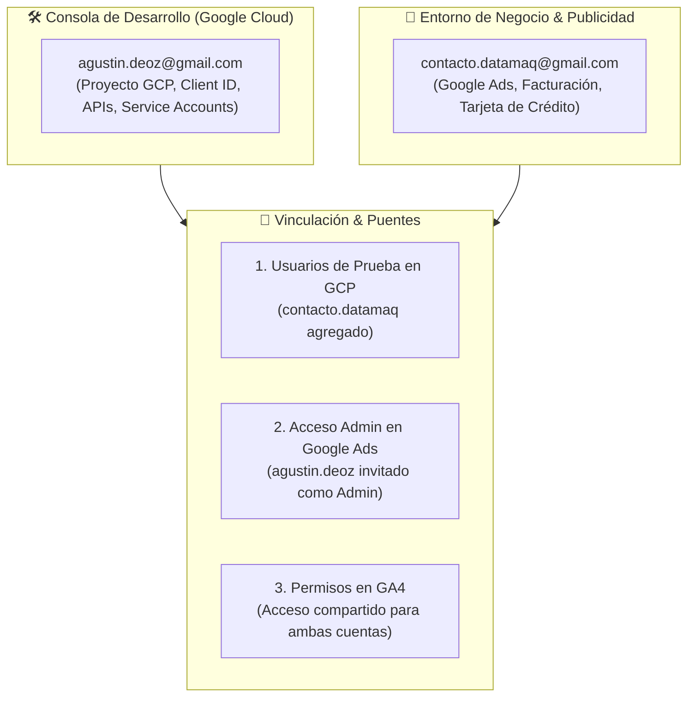
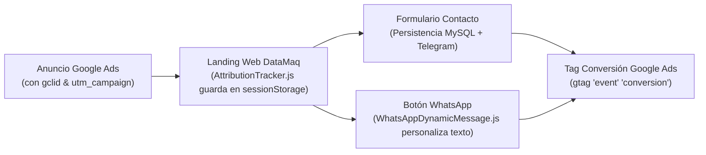

# Guía de Gobernanza de Cuentas Google, Analytics, Ads y MCPs — DataMaq

> **Proyecto:** DataMaq (`datamaq.com.ar`)  
> **Estado:** Documento Vivo (Living SSOT)  
> **Ámbito:** Topología de cuentas Google, OAuth2, tracking de conversiones, Google Ads, GA4, Microsoft Clarity y Model Context Protocol (MCP).

---

## 1. Topología y Gobernanza de Cuentas

DataMaq opera con una separación clara de responsabilidades entre la cuenta de desarrollo/técnica y la cuenta institucional/comercial:



### Matriz de Permisos y Accesos Cruzados

| Servicio / Consola | Cuenta Propietaria (Owner) | Cuenta Secundaria / Invitada | Rol Asignado & Estado |
|---|---|---|---|
| **Google Cloud Console (GCP)** | `agustin.deoz@gmail.com` *(Project: 395333970129)* | `contacto.datamaq@gmail.com` | Usuario de prueba (*Test User*) en Pantalla OAuth |
| **Google Ads Anuncios (`405-777-8237`)** | `contacto.datamaq@gmail.com` | `agustin.deoz@gmail.com` | **Administrador** (Vinculación Activa) |
| **Google Ads MCC (`131-878-0733`)** | `agustin.deoz@gmail.com` | N/A | Propietario del Developer Token (Solicitud Basic Access Presentada) |
| **Google Analytics 4 (`G-ME...`)** | `contacto.datamaq@gmail.com` | `agustin.deoz@gmail.com` | Editor / Administrador |
| **Microsoft Clarity (`wx5hfvmv5y`)** | `contacto.datamaq@gmail.com` | `agustin.deoz@gmail.com` | Administrador de proyecto |

---

## 2. Mapa Completo de Variables de Entorno (`.env`)

```ini
# ==============================================================================
# 1. FRONTEND / TRACKING EN PRODUCCIÓN (VPS DonWeb)
# ==============================================================================
GOOGLE_ANALYTICS_ID=G-MEXXXXXXXX                 # Tag de medición web de GA4
GOOGLE_ADS_ID=AW-1XXXXXXXXX                      # Tag global de Google Ads (remarketing)
GOOGLE_ADS_CONVERSION_ID=AW-1XXXXXXXXX/AbCdEf... # Acción de conversión: Envío de formulario
GOOGLE_ADS_WHATSAPP_CONVERSION_ID=AW-1XXXXXXXXX/GhIjKl... # Acción de conversión: Clic en WhatsApp
CLARITY_ID=wx5hXXXXXX                           # Tag de Microsoft Clarity (heatmaps)

# ==============================================================================
# 2. BACKEND / MCP & APIS ANALÍTICAS (Desarrollo & Agentes)
# ==============================================================================
# Google Ads API (OAuth2)
GOOGLE_ADS_DEVELOPER_TOKEN=ETBqXXXXXXXXXXXXX     # Token de desarrollador aprobado
GOOGLE_ADS_CLIENT_ID=3953XXXXXXXX.apps.googleusercontent.com
GOOGLE_ADS_CLIENT_SECRET=GOCSXXXXXXXXXXXXXXXXX
GOOGLE_ADS_REFRESH_TOKEN=1//0gXXXXXXXXXXXXXX     # Obtenido vía scripts/auth_google_ads.py
GOOGLE_ADS_LOGIN_CUSTOMER_ID=XXXXXXXXXX          # ID de cuenta de Google Ads (10 dígitos sin guiones)

# Google Analytics 4 Data API (Service Account)
GOOGLE_APPLICATION_CREDENTIALS=/ruta/a/key.json  # Clave JSON de Cuenta de Servicio GCP
GA4_PROPERTY_ID=XXXXXXXXX                        # ID numérico de propiedad GA4 (9 dígitos)

# Microsoft Clarity API
CLARITY_API_TOKEN=XXXXXXXXXXXXXXXXXXXXXXXX       # Token de acceso para reportes de UX
```

---

## 3. Procedimiento de Autenticación OAuth2 para Google Ads

Para permitir que los subagentes consulten el gasto publicitario y las palabras clave en tiempo real, se requiere generar el `GOOGLE_ADS_REFRESH_TOKEN`.

### 3.1 Requisitos Previos en Google Cloud Console
1. Ir a [Google Cloud Console $\rightarrow$ Pantalla de consentimiento de OAuth](https://console.cloud.google.com/apis/credentials/consent).
2. En **Usuarios de prueba**, agregar `agustin.deoz@gmail.com` y `contacto.datamaq@gmail.com`.
3. Ir a [Credenciales](https://console.cloud.google.com/apis/credentials), hacer clic en el ID de cliente OAuth 2.0 y en **URIs de redireccionamiento autorizados** agregar:
   - `http://127.0.0.1:8080`
   - `http://localhost:8080`

### 3.2 Ejecución del Asistente Local
```bash
./venv/bin/python3 scripts/auth_google_ads.py
```
1. El script levantará un servidor local temporal en `http://127.0.0.1:8080` y mostrará la URL de autorización.
2. Abrir el enlace en el navegador y autorizar con `contacto.datamaq@gmail.com` o `agustin.deoz@gmail.com`.
3. El script capturará el código de respuesta, lo canjeará por el Refresh Token y te imprimirá la línea `GOOGLE_ADS_REFRESH_TOKEN=...` para pegar en el `.env`.

### 3.3 Solicitud de Acceso Básico (Basic Access)
Para consultar cuentas reales en producción, se presentó la solicitud de **Acceso Básico** ante Google Ads API con el documento oficial de diseño y arquitectura:
* **Documento Técnico Adjunto:** [`docs/DataMaq_Google_Ads_API_Tool_Documentation.pdf`](DataMaq_Google_Ads_API_Tool_Documentation.pdf).
* **Generador Automatizado:** [`scripts/generate_google_ads_api_doc.py`](../scripts/generate_google_ads_api_doc.py).
* **Estado:** Solicitud formalmente enviada y en revisión por el equipo de Google Ads.

---

## 4. Integración de Google Analytics 4 (Data API)

1. En GCP, la **Google Analytics Data API** está habilitada en el proyecto `datamaq-505320`.
2. Se generó la Cuenta de Servicio `ga4-analytics-reader@datamaq-505320.iam.gserviceaccount.com` con su clave JSON resguardada localmente.
3. En [Google Analytics](https://analytics.google.com/) $\rightarrow$ **Administrar** $\rightarrow$ **Gestión de accesos a la propiedad**, la Service Account cuenta con rol **Lector**.
4. Configuración activa en `.env`:
   ```bash
   GOOGLE_APPLICATION_CREDENTIALS=/home/agustin/.config/gcp/datamaq-ga4-key.json
   GA4_PROPERTY_ID=533265197
   ```

---

## 5. Suite de Servidores FastMCP (Google Ads, GA4 y Clarity)

DataMaq cuenta con 3 servidores FastMCP dedicados para que los asistentes de IA y subagentes ejecutivos auditen el rendimiento comercial y técnico en tiempo real:

1. **Google Ads MCP ([`scripts/mcp_google_ads_server.py`](../scripts/mcp_google_ads_server.py)):**
   * `get_google_ads_status`: Estado de credenciales y límite de presupuesto diario.
   * `get_campaign_performance`: Impresiones, clics, costo ARS, conversiones y CPC.
   * `get_search_terms_report`: Consultas de búsqueda reales de usuarios para detectar negativas.
   * `get_daily_budget_pacing`: Auditoría de gasto acumulado hoy vs. límite de **$1.500 ARS/día**.
   * *Diagnóstico:* Autenticación OAuth2 validada; métricas de búsqueda pendientes de aprobación de *Basic Access* en Google Ads API Center.

2. **Google Analytics 4 MCP ([`scripts/mcp_ga4_server.py`](../scripts/mcp_ga4_server.py)):**
   * `get_ga4_status`: Estado de conexión con la propiedad de GA4 (`533265197`).
   * `get_ga4_top_pages`: Páginas más visitadas con soporte de segmentación (`segment='all'`, `'commercial'`, `'academic'`).
   * `get_ga4_traffic_sources`: Canales de origen (SEO orgánico, Ads, directo, UTMs).
   * `get_ga4_geo_traffic`: Tráfico desglosado por localidad (Pilar, Garín, Tigre, etc.).
   * `get_ga4_conversions`: Conteo de eventos `generate_lead` y `whatsapp_click` (disparados nativamente vía `gtag`).

3. **Microsoft Clarity MCP ([`scripts/mcp_clarity_server.py`](../scripts/mcp_clarity_server.py)):**
   * `get_clarity_project_info`: ID del proyecto (`wx5hfvmv5y`), links a grabaciones y heatmaps.
   * `get_live_insights`: Usuarios activos y páginas vistas en tiempo real.
   * `get_dashboard_insights`: Métricas de fricción (*rage clicks*, *dead clicks*, *excessive scrolling*, *quickbacks* y *scroll depth* sobre ventana de 1 a 3 días).
   * *Gobernanza:* Telemetría gobernada por consentimiento previo (`CookieManager.js`) y redirección 301 de `/monitoreo` hacia `app.datamaq.com.ar`.

### Suite de Pruebas Unitarias de MCPs:
La suite completa de tests automatizados (`tests/test_mcp_google_ads.py`, `tests/test_mcp_ga4.py`, `tests/test_mcp_clarity.py`) cuenta con **446 tests pasando al 100%** y **0 errores de Pyright** con tipado estricto.

### Configuración Unificada en `mcp_config.json`:
```json
{
  "mcpServers": {
    "google-ads": {
      "command": "/home/agustin/proyectos_software/www-datamaq/venv/bin/python3",
      "args": ["/home/agustin/proyectos_software/www-datamaq/scripts/mcp_google_ads_server.py"]
    },
    "google-analytics": {
      "command": "/home/agustin/proyectos_software/www-datamaq/venv/bin/python3",
      "args": ["/home/agustin/proyectos_software/www-datamaq/scripts/mcp_ga4_server.py"]
    },
    "microsoft-clarity": {
      "command": "/home/agustin/proyectos_software/www-datamaq/venv/bin/python3",
      "args": ["/home/agustin/proyectos_software/www-datamaq/scripts/mcp_clarity_server.py"],
      "env": {
        "CLARITY_ID": "wx5hfvmv5y"
      }
    }
  }
}
```

---

## 6. Blindaje de Seguridad y Content Security Policy (CSP)

Para evitar que los navegadores bloqueen el envío de balizas y conversiones de Google Ads y Analytics, el middleware [`src/infrastructure/fastapi/middleware.py`](file:///home/agustin/proyectos_software/www-datamaq/src/infrastructure/fastapi/middleware.py) aplica una lista blanca estricta verificada con pruebas automatizadas ([`tests/test_csp_headers.py`](file:///home/agustin/proyectos_software/www-datamaq/tests/test_csp_headers.py)):

* **`script-src`:** `https://www.googletagmanager.com`, `https://www.google-analytics.com`, `https://www.googleadservices.com`, `https://googleads.g.doubleclick.net`, `https://www.google.com`, `https://www.clarity.ms`.
* **`img-src`:** `https://www.google-analytics.com`, `https://www.googleadservices.com`, `https://googleads.g.doubleclick.net`, `https://www.google.com`, `https://www.clarity.ms`.
* **`connect-src`:** `https://www.google-analytics.com`, `https://www.googleadservices.com`, `https://googleads.g.doubleclick.net`, `https://stats.g.doubleclick.net`, `https://www.google.com`, `https://www.clarity.ms`.

---

## 7. Pipeline de Atribución y WhatsApp Dinámico



1. **Atribución First-Touch:** [`static/js/modules/AttributionTracker.js`](file:///home/agustin/proyectos_software/www-datamaq/static/js/modules/AttributionTracker.js) preserva el origen durante toda la navegación.
2. **Mensajes Dinámicos:** [`static/js/modules/WhatsAppDynamicMessage.js`](file:///home/agustin/proyectos_software/www-datamaq/static/js/modules/WhatsAppDynamicMessage.js) adapta el mensaje de apertura según la campaña SEM (`calidad-energia`, `retrofit-iot`, `mantenimiento-amba`).
3. **Notificación Instantánea:** El backend notifica a Telegram en menos de 2 segundos con el detalle de campaña y ubicación del lead.
