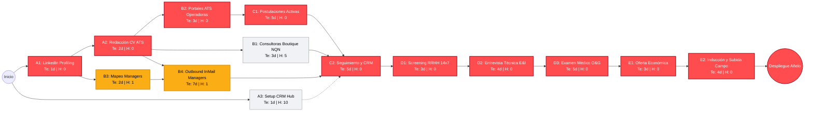

# Modelo PERT y Análisis de Camino Crítico (CPM) — Inserción en Vaca Muerta

**Candidato:** Agustín Leonardo Bustos  
**Objetivo Estratégico:** Inserción laboral efectiva en la Cuenca Neuquina (Vaca Muerta) en posiciones de Mantenimiento Eléctrico de Potencia (MT/BT), Variadores (VFD), Instrumentación y Confiabilidad Operacional (APM / CBM).  
**Horizonte Temporal Estimado:** 35 días hábiles (~7 semanas calendario).  
**Metodología:** Program Evaluation and Review Technique (PERT) y Critical Path Method (CPM).

---

## 1. Estructura de Desglose del Trabajo (EDT / WBS)

El proceso de posicionamiento, prospección, validación y contratación se divide en cinco fases secuenciales y concurrentes:

1. **Fase 1: Alistamiento de Activos y Perfil Digital (Días 1–3)**
   * Actualización técnica en LinkedIn (SEO, reenmarcado semántico y 20 skills).
   * Confección de CV optimizado para filtros ATS petroleros.
   * Inicialización y testeo de la base de datos y herramientas de seguimiento de Datamaq Hub.
2. **Fase 2: Prospección Multicanal y Tracción en la Cuenca (Días 4–11)**
   * Activación de consultoras boutique regionales (Neuquén/Añelo).
   * Carga curricular en portales ATS de operadoras (YPF, Techint, PAE, Vista).
   * Mapeo y prospección directa Outbound a Hiring Managers (Superintendentes y Jefes de Planta).
3. **Fase 3: Postulaciones Formales y Gestión de Pipeline (Días 7–16)**
   * Aplicaciones dirigidas a vacantes activas.
   * Registro sistemático de interacciones y feedback en CRM relacional.
4. **Fase 4: Rondas de Entrevistas y Acreditación de Campo (Días 17–28)**
   * Screening inicial de RRHH (disponibilidad rotacional 14x7, logística).
   * Entrevista técnica de profundidad con supervisores de mantenimiento.
   * Examen médico preocupacional de ley (aptitud meseta/altura y turnos rotativos).
5. **Fase 5: Negociación, Contratación y Onboarding (Días 29–35)**
   * Propuesta formal y firma de contrato.
   * Inducción de seguridad de cuenca (HSE), entrega de EPP y subida al yacimiento.

---

## 2. Estimaciones Temporales PERT

Cada actividad cuenta con tres estimaciones temporales en días hábiles:
* $o$ = Tiempo optimista
* $m$ = Tiempo más probable
* $p$ = Tiempo pesimista
* $T_e = \frac{o + 4m + p}{6}$ (Tiempo esperado)
* $\sigma^2 = \left(\frac{p - o}{6}\right)^2$ (Varianza)

| ID | Actividad | Predecesores | $o$ | $m$ | $p$ | $T_e$ (días) | Varianza ($\sigma^2$) |
|:---|:---|:---:|:---:|:---:|:---:|:---:|:---:|
| **A1** | Actualización de Perfil LinkedIn (Titular, Acerca de, 20 Skills, Ubicación Neuquén) | — | 1 | 1 | 2 | **1.0** | 0.03 |
| **A2** | Confección de CV Formato ATS (1 y 2 págs, MT 13.2kV, VFD, CBM, APM) | A1 | 1 | 2 | 3 | **2.0** | 0.11 |
| **A3** | Setup y Verificación de CRM Datamaq Hub (SQLite + VPS MySQL y CLI) | — | 0.5 | 1 | 2 | **1.0** | 0.06 |
| **B1** | Contacto con Consultoras Boutique de Neuquén (Patagonia, Vincular, SI-RH) | A2 | 2 | 3 | 5 | **3.0** | 0.25 |
| **B2** | Carga de Perfil en ATS de Operadoras (YPF, Techint, PAE, Vista) | A2 | 2 | 3 | 5 | **3.0** | 0.25 |
| **B3** | Mapeo de Hiring Managers en LinkedIn (Superintendentes y Jefes de Planta) | A1 | 1 | 2 | 3 | **2.0** | 0.11 |
| **B4** | Prospección Directa Outbound (InMail a Hiring Managers con pitch técnico) | B3, A2 | 5 | 7 | 10 | **7.0** | 0.69 |
| **C1** | Postulaciones Formales a Vacantes Específicas en Portales ATS | B2 | 3 | 5 | 8 | **5.0** | 0.69 |
| **C2** | Gestión Activa de Respuestas y Seguimiento CRM (`gestionar_empleo_db.py`) | C1, B4, B1 | 4 | 5 | 7 | **5.0** | 0.25 |
| **D1** | Screening Telefónico / RRHH (Disponibilidad 14x7, logística, remuneración) | C2 | 2 | 3 | 5 | **3.0** | 0.25 |
| **D2** | Entrevistas Técnicas con Jefatura / Superintendencia de Mantenimiento | D1 | 3 | 4 | 6 | **4.0** | 0.25 |
| **D3** | Examen Médico Preocupacional O&G (Aptitud meseta/altura y turnos rotativos) | D2 | 3 | 5 | 8 | **5.0** | 0.69 |
| **E1** | Propuesta Económica Formal, Negociación y Cierre | D3 | 2 | 3 | 5 | **3.0** | 0.25 |
| **E2** | Inducción HSE de Cuenca, Asignación de EPP y Despliegue en Yacimiento | E1 | 3 | 4 | 6 | **4.0** | 0.25 |

---

## 3. Matriz de Tiempos Tempranos, Tardíos y Holguras (CPM)

* **ES** (*Early Start*): Momento más temprano de inicio.
* **EF** (*Early Finish*): Momento más temprano de finalización ($ES + T_e$).
* **LS** (*Late Start*): Momento más tardío de inicio sin retrasar el proyecto ($LF - T_e$).
* **LF** (*Late Finish*): Momento más tardío de finalización.
* **Holgura Total ($H_T$)**: $LS - ES = LF - EF$.
* **Actividad Crítica**: Aquella cuya holgura es cero ($H_T = 0$).

| ID | Actividad | $T_e$ | ES | EF | LS | LF | Holgura ($H_T$) | Estado de Ruta |
|:---|:---|:---:|:---:|:---:|:---:|:---:|:---:|:---|
| **A1** | Actualización Perfil LinkedIn | 1.0 | 0 | 1 | 0 | 1 | **0** | **CAMINO CRÍTICO** |
| **A2** | Confección CV Formato ATS | 2.0 | 1 | 3 | 1 | 3 | **0** | **CAMINO CRÍTICO** |
| **A3** | Setup CRM Datamaq Hub | 1.0 | 0 | 1 | 10 | 11 | 10 | Holgura amplia |
| **B1** | Consultoras Boutique Neuquén | 3.0 | 3 | 6 | 8 | 11 | 5 | Holgura moderada |
| **B2** | Carga ATS Operadoras | 3.0 | 3 | 6 | 3 | 6 | **0** | **CAMINO CRÍTICO** |
| **B3** | Mapeo Hiring Managers | 2.0 | 1 | 3 | 2 | 4 | 1 | **Sub-crítico** |
| **B4** | Prospección Outbound InMail | 7.0 | 3 | 10 | 4 | 11 | 1 | **Sub-crítico** |
| **C1** | Postulaciones Formales ATS | 5.0 | 6 | 11 | 6 | 11 | **0** | **CAMINO CRÍTICO** |
| **C2** | Seguimiento Activo en CRM | 5.0 | 11 | 16 | 11 | 16 | **0** | **CAMINO CRÍTICO** |
| **D1** | Screening Telefónico RRHH | 3.0 | 16 | 19 | 16 | 19 | **0** | **CAMINO CRÍTICO** |
| **D2** | Entrevista Técnica Mantenimiento | 4.0 | 19 | 23 | 19 | 23 | **0** | **CAMINO CRÍTICO** |
| **D3** | Examen Médico Preocupacional | 5.0 | 23 | 28 | 23 | 28 | **0** | **CAMINO CRÍTICO** |
| **E1** | Propuesta Formal y Oferta | 3.0 | 28 | 31 | 28 | 31 | **0** | **CAMINO CRÍTICO** |
| **E2** | Inducción HSE y Despliegue | 4.0 | 31 | 35 | 31 | 35 | **0** | **CAMINO CRÍTICO** |

---

## 4. Diagrama PERT / CPM de Red

---

## 5. Análisis del Camino Crítico y Cuellos de Botella

### 5.1. Camino Crítico Principal (Duración: 35 días hábiles)
$$\mathbf{A1 \longrightarrow A2 \longrightarrow B2 \longrightarrow C1 \longrightarrow C2 \longrightarrow D1 \longrightarrow D2 \longrightarrow D3 \longrightarrow E1 \longrightarrow E2}$$

Cualquier demora en estas actividades posterga directamente la fecha de inserción laboral en campo.

### 5.2. Ruta Sub-Crítica de Alto Rendimiento (Holgura = 1 día)
$$\mathbf{A1 \longrightarrow B3 \longrightarrow B4 \longrightarrow C2 \dots}$$

* **Importancia Estratégica:** Contactar a Superintendentes de Mantenimiento y Jefes de Planta vía InMail (**B4**) cuenta con una holgura de tan solo **1 día hábil**.
* **Efecto Acelerador:** Mientras las postulaciones por ATS (**C1**) siguen su curso formal corporativo, la prospección directa suele generar reuniones y acelerar el paso a **D1/D2** sin quedar retenido en el filtro automático del software de reclutamiento.

### 5.3. Análisis Estadístico de Incertidumbre
* **Varianza total del camino crítico ($\sigma^2$):**
  $$\sigma^2 = 0.03 + 0.11 + 0.25 + 0.69 + 0.25 + 0.25 + 0.25 + 0.69 + 0.25 + 0.25 = 3.02\text{ días}^2$$
* **Desviación estándar ($\sigma$):**
  $$\sigma = \sqrt{3.02} \approx 1.74\text{ días hábiles}$$
* **Intervalo de Confianza (95% de probabilidad, $Z = 1.645$):**
  $$T_{95\%} = 35 \pm (1.645 \times 1.74) = 35 \pm 2.86\text{ días}$$
  * Con una probabilidad del 95%, el objetivo se alcanzará entre los **32 y los 38 días hábiles** de ejecución disciplinada (~6.5 a 8 semanas).

---

## 6. Plan de Contingencia y Técnicas de Aceleración

1. **Fast-Tracking (Ejecución en Paralelo):**
   * No esperar a completar la carga en todos los portales ATS (**B2**) para iniciar la prospección InMail (**B4**). En cuanto el CV esté listo (**A2**), disparar los primeros 3 InMail diarios a Superintendentes.
   * Solicitar turnos para el preocupacional (**D3**) de manera preventiva o agilizar antecedentes médicos ni bien finalice la entrevista técnica (**D2**).
2. **Crashing (Compresión de Tiempos):**
   * Si **B2/C1** sufren demoras por burocracia de los ATS corporativos, concentrar esfuerzo en las 5 consultoras boutique locales (**B1**), las cuales tienen diálogo directo por WhatsApp con los Jefes de Base en Neuquén y Añelo.
3. **Control y Disciplina de Gestión:**
   * Utilizar diariamente `python scripts/gestionar_empleo_db.py stats` para revisar qué oportunidades están en estado `DETECTADA`, `POSTULADA` o `ENTREVISTA` y garantizar que ninguna postulación supere los 5 días hábiles sin contacto de seguimiento registrado.
