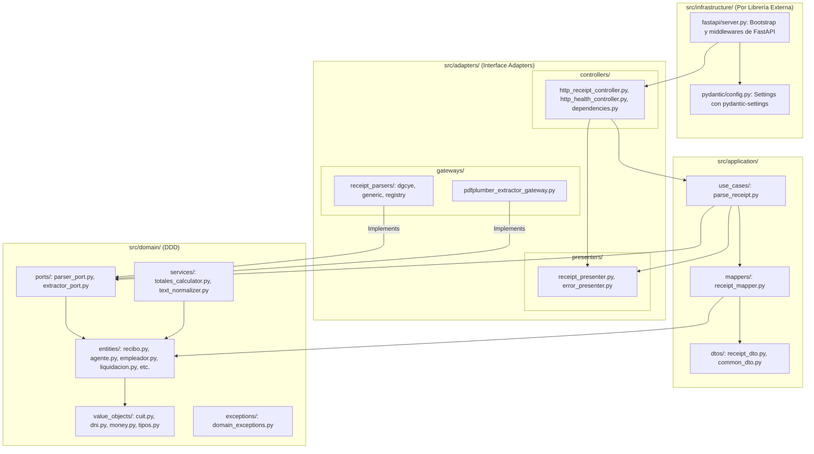

# Plan de Implementación: Clean Architecture y DDD (Infraestructura por Librería Externa)

## 1. Goal Description
Estructurar **Datamaq Hub** bajo un diseño arquitectónico riguroso y desacoplado, combinando **Clean Architecture**, **Ports & Adapters** y **Domain-Driven Design (DDD)**:

- **`src/domain/`**: Entidades y reglas de negocio del dominio (`entities/`, `value_objects/`, `services/`, `ports/`, `exceptions/`).
- **`src/application/`**: Orquestación de casos de uso y modelos de transferencia (`use_cases/`, `dtos/`, `mappers/`).
- **`src/adapters/`**: Adaptadores de interfaz (`controllers/`, `gateways/`, `presenters/`).
- **`src/infrastructure/`**: Organizado por **librería externa / tecnología proveedora**:
  - **`fastapi/`**: Servidor ASGI, middlewares, CORS y bootstrap de FastAPI (`server.py`).
  - **`pydantic/`**: Configuración de entorno y settings con `pydantic-settings` (`config.py`).
- **`src/main.py`**: Punto de entrada raíz para Uvicorn (`app = create_app()`).



---

## 2. Estructura de Directorios Completa

```
datamaq-hub/
├── data/
│   └── 36528392-2026-08-13-17_12_03_336.pdf
├── docs/
│   └── recibo_parser_plan.md
├── src/
│   ├── __init__.py
│   ├── main.py                                      # Entrypoint ASGI: app = create_app()
│   │
│   ├── domain/                                      # 1. CAPA DE DOMINIO (DDD)
│   │   ├── __init__.py
│   │   ├── entities/                                # Entidades del modelo
│   │   │   ├── __init__.py
│   │   │   ├── recibo.py                            # ReciboSueldo, ResumenLiquidoItem, Totales
│   │   │   ├── agente.py                            # Agente
│   │   │   ├── empleador.py                         # Empleador
│   │   │   ├── liquidacion.py                       # LiquidacionSecuencia
│   │   │   ├── concepto.py                          # ConceptoItem
│   │   │   ├── establecimiento.py                   # EstablecimientoDetalle
│   │   │   └── cargo.py                             # CargoDetalle
│   │   ├── value_objects/                           # Objetos de valor inmutables
│   │   │   ├── __init__.py
│   │   │   ├── cuit.py                              # CUIT (con Módulo 11)
│   │   │   ├── dni.py                               # DNI
│   │   │   ├── money.py                             # ImporteMonetario
│   │   │   └── tipos.py                             # TipoConcepto, TipoRecibo
│   │   ├── services/                                # Servicios puros de dominio
│   │   │   ├── __init__.py
│   │   │   ├── totales_calculator.py                # TotalesCalculatorService
│   │   │   └── text_normalizer.py                   # TextNormalizerService
│   │   ├── ports/                                   # Interfaces abstractas (Ports)
│   │   │   ├── __init__.py
│   │   │   ├── parser_port.py                       # ReceiptParserPort, ReceiptParserRegistryPort
│   │   │   └── extractor_port.py                    # PDFExtractorPort, ExtractedPDF, PageData
│   │   └── exceptions/                              # Excepciones de dominio
│   │       ├── __init__.py
│   │       └── domain_exceptions.py                 # ReceiptParsingError, InvalidPDFError
│   │
│   ├── application/                                 # 2. CAPA DE APLICACIÓN
│   │   ├── __init__.py
│   │   ├── use_cases/                               # Casos de uso
│   │   │   ├── __init__.py
│   │   │   └── parse_receipt.py                     # ParseReceiptUseCase
│   │   ├── dtos/                                    # Data Transfer Objects
│   │   │   ├── __init__.py
│   │   │   ├── receipt_dto.py                       # ReceiptResponseDTO, AgentDTO, etc.
│   │   │   └── common_dto.py                        # APIResponse, ErrorDTO, HealthDTO
│   │   └── mappers/                                 # Mapeadores Entidad <-> DTO
│   │       ├── __init__.py
│   │       └── receipt_mapper.py                    # ReceiptMapper (ReciboSueldo -> ReceiptResponseDTO)
│   │
│   ├── adapters/                                    # 3. CAPA DE ADAPTADORES (Interface Adapters)
│   │   ├── __init__.py
│   │   ├── controllers/                             # Inbound Controllers
│   │   │   ├── __init__.py
│   │   │   ├── http_receipt_controller.py           # Endpoint POST /api/v1/recibos/parse
│   │   │   ├── http_health_controller.py            # Endpoint GET /api/v1/health
│   │   │   └── dependencies.py                      # Inyección de dependencias hacia UseCases
│   │   ├── gateways/                                # Outbound Gateways / I/O
│   │   │   ├── __init__.py
│   │   │   ├── pdfplumber_extractor_gateway.py      # Gateway extractor pdfplumber
│   │   │   └── receipt_parsers/
│   │   │       ├── __init__.py
│   │   │       ├── dgcye_parser_gateway.py          # Gateway parser DGCyE PBA
│   │   │       ├── generic_parser_gateway.py        # Gateway parser Genérico
│   │   │       └── parser_registry_gateway.py       # Registry de parsers
│   │   └── presenters/                              # Presenters de salida
│   │       ├── __init__.py
│   │       ├── receipt_presenter.py                 # Formateo de respuestas HTTP JSON
│   │       └── error_presenter.py                   # Formateo y exception handlers HTTP
│   │
│   └── infrastructure/                              # 4. CAPA DE INFRAESTRUCTURA (Por Librería Externa)
│       ├── __init__.py
│       ├── fastapi/                                 # Proveedor FastAPI
│       │   ├── __init__.py
│       │   └── server.py                            # Factory FastAPI y middlewares CORS
│       └── pydantic/                                # Proveedor Pydantic Settings
│           ├── __init__.py
│           └── config.py                            # Settings con pydantic-settings
│
├── tests/
│   ├── __init__.py
│   ├── conftest.py
│   ├── unit/
│   │   ├── __init__.py
│   │   ├── test_value_objects.py
│   │   ├── test_entities.py
│   │   ├── test_domain_services.py
│   │   ├── test_mappers.py
│   │   ├── test_presenters.py
│   │   └── test_use_cases.py
│   └── integration/
│       ├── __init__.py
│       ├── test_gateways.py
│       └── test_controllers.py
│
├── CONVENTIONS.md
├── requirements.txt
└── README.md
```

---

## 3. Plan de Verificación

### Automated Tests
```bash
./venv/bin/ruff check .
./venv/bin/ruff format --check .
./venv/bin/pytest -v
```

### Manual Verification
```bash
./venv/bin/uvicorn src.main:app --reload --port 8000
curl -X POST "http://localhost:8000/api/v1/recibos/parse" \
  -H "accept: application/json" \
  -H "Content-Type: multipart/form-data" \
  -F "file=@data/36528392-2026-08-13-17_12_03_336.pdf"
```
