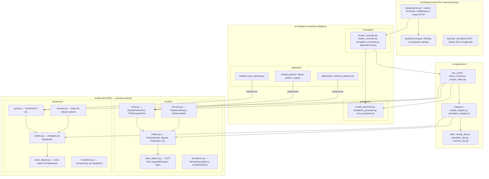

# Plan de Implementación: Clean Architecture y DDD (Infraestructura por Librería Externa)

## 1. Goal Description
Estructurar **Datamaq Hub** bajo un diseño arquitectónico riguroso y desacoplado, combinando **Clean Architecture**, **Ports & Adapters** y **Domain-Driven Design (DDD)**:

- **`src/domain/`**: Entidades y reglas de negocio del dominio (`entities/`, `value_objects/`, `services/`, `ports/`, `exceptions/`).
- **`src/application/`**: Orquestación de casos de uso y modelos de transferencia (`use_cases/`, `dtos/`, `mappers/`).
- **`src/adapters/`**: Adaptadores de interfaz (`controllers/`, `gateways/`, `presenters/`).
- **`src/infrastructure/`**: Organizado por **librería externa / tecnología proveedora**:
  - **`fastapi/`**: Servidor ASGI, middlewares, CORS y bootstrap de FastAPI (`server.py`).
  - **`pydantic/`**: Configuración de entorno y settings con `pydantic-settings` (`config.py`).
- **`src/main.py`**: Punto de entrada raíz para Uvicorn (`app = create_app()`).



---

## 2. Estructura de Directorios Completa

```
datamaq-hub/
├── data/
│   └── 36528392-2026-08-13-17_12_03_336.pdf
├── docs/
│   └── recibo_parser_plan.md
├── src/
│   ├── __init__.py                                  # 0 bytes
│   ├── main.py                                      # Entrypoint ASGI: app = create_app()
│   │
│   ├── domain/                                      # 1. CAPA DE DOMINIO (DDD — estructura plana)
│   │   ├── __init__.py                              # 0 bytes
│   │   ├── recibos/                                 # Bounded context: Recibos de Sueldo
│   │   │   ├── __init__.py                          # 0 bytes (load-bearing para pytest)
│   │   │   ├── entities.py                          # ReciboSueldo, Agente, Empleador, etc.
│   │   │   ├── value_objects.py                     # CUIT, DNI, ImporteMonetario, TipoConcepto, TipoRecibo
│   │   │   ├── services.py                          # TotalesCalculatorService, TextNormalizerService
│   │   │   ├── ports.py                             # ReceiptParserPort, PDFExtractorPort, etc.
│   │   │   └── exceptions.py                        # ReceiptParsingError, InvalidPDFError
│   │   └── liquidacion/                             # Bounded context: Liquidación / Proyección Salarial
│   │       ├── __init__.py                          # 0 bytes (load-bearing para pytest)
│   │       ├── entities.py                          # Entidades de liquidación y proyección
│   │       ├── value_objects.py                     # Value Objects de liquidación
│   │       ├── services.py                          # Motor de cálculo salarial
│   │       ├── ports.py                             # ParitariaPort, etc.
│   │       └── exceptions.py                        # Excepciones de dominio de liquidación
│   │
│   ├── application/                                 # 2. CAPA DE APLICACIÓN
│   │   ├── __init__.py                              # 0 bytes
│   │   ├── use_cases/                               # Casos de uso
│   │   │   ├── __init__.py                          # 0 bytes
│   │   │   ├── parse_receipt.py                     # ParseReceiptUseCase
│   │   │   └── project_salary.py                    # ProjectSalaryUseCase
│   │   ├── dtos/                                    # Data Transfer Objects
│   │   │   ├── __init__.py                          # 0 bytes
│   │   │   ├── receipt_dto.py                       # ReceiptResponseDTO, AgentDTO, etc.
│   │   │   ├── simulation_dto.py                    # SimulationRequestDTO, SimulationResponseDTO
│   │   │   └── common_dto.py                        # APIResponse, ErrorDTO, HealthDTO
│   │   └── mappers/                                 # Mapeadores Entidad <-> DTO
│   │       ├── __init__.py                          # 0 bytes
│   │       ├── receipt_mapper.py                    # ReceiptMapper (ReciboSueldo -> ReceiptResponseDTO)
│   │       └── simulation_mapper.py                 # SimulationMapper
│   │
│   ├── adapters/                                    # 3. CAPA DE ADAPTADORES (Interface Adapters)
│   │   ├── __init__.py                              # 0 bytes
│   │   ├── controllers/                             # Inbound Controllers (agnósticos de transporte)
│   │   │   ├── __init__.py                          # 0 bytes
│   │   │   ├── receipt_controller.py                # Lógica POST /api/v1/recibos/parse
│   │   │   ├── health_controller.py                 # Lógica GET /api/v1/health
│   │   │   ├── simulation_controller.py             # Lógica POST /api/v1/simulation
│   │   │   └── dependencies.py                      # Inyección de dependencias con @lru_cache
│   │   ├── gateways/                                # Outbound Gateways / I/O
│   │   │   ├── __init__.py                          # 0 bytes
│   │   │   ├── pdfplumber_extractor_gateway.py      # Gateway extractor pdfplumber
│   │   │   ├── paritaria_json_gateway.py            # Gateway loader JSON de paritarias
│   │   │   └── receipt_parsers/
│   │   │       ├── __init__.py                      # 0 bytes
│   │   │       ├── dgcye_parser_gateway.py          # Gateway parser DGCyE PBA
│   │   │       ├── generic_parser_gateway.py        # Gateway parser Genérico
│   │   │       └── parser_registry_gateway.py       # Registry de parsers
│   │   └── presenters/                              # Presenters de salida
│   │       ├── __init__.py                          # 0 bytes
│   │       ├── receipt_presenter.py                 # Formateo de respuestas HTTP JSON de recibos
│   │       ├── simulation_presenter.py              # Formateo de respuestas de simulación
│   │       └── error_presenter.py                   # Formateo y exception handlers HTTP
│   │
│   └── infrastructure/                              # 4. CAPA DE INFRAESTRUCTURA (Por Librería Externa)
│       ├── __init__.py                              # 0 bytes
│       ├── fastapi/                                 # Proveedor FastAPI
│       │   ├── __init__.py                          # 0 bytes
│       │   ├── server.py                            # Factory FastAPI y middlewares CORS
│       │   └── routes/                              # Routers HTTP (endpoints @router.post/get)
│       │       ├── __init__.py                      # 0 bytes
│       │       ├── health_routes.py                 # Router /api/v1/health
│       │       ├── receipt_routes.py                # Router /api/v1/recibos
│       │       └── simulation_routes.py             # Router /api/v1/simulation
│       ├── fastmcp/                                 # Proveedor FastMCP (servidores MCP)
│       │   ├── __init__.py                          # 0 bytes
│       │   ├── clarity.py                           # Servidor MCP Microsoft Clarity
│       │   ├── ga4.py                               # Servidor MCP Google Analytics 4
│       │   └── google_ads.py                        # Servidor MCP Google Ads
│       └── pydantic/                                # Proveedor Pydantic Settings
│           ├── __init__.py                          # 0 bytes
│           └── config.py                            # Settings con pydantic-settings
│
├── tests/
│   ├── __init__.py                                  # 0 bytes
│   ├── conftest.py                                  # Fixtures: client, sample_pdf_path, sample_pdf_bytes
│   ├── test_architecture_boundaries.py              # Verifica reglas de dependencia entre capas
│   ├── test_empty_inits.py                          # Garantiza que todos los __init__.py midan 0 bytes
│   ├── unit/
│   │   ├── __init__.py                              # 0 bytes
│   │   ├── test_value_objects.py
│   │   ├── test_entities.py
│   │   ├── test_domain_services.py
│   │   ├── test_salary_engine.py
│   │   ├── test_mappers.py
│   │   ├── test_presenters.py
│   │   └── test_use_cases.py
│   ├── integration/
│   │   ├── __init__.py                              # 0 bytes
│   │   ├── test_gateways.py
│   │   ├── test_controllers.py
│   │   └── test_simulation_controller.py
│   └── mcp/
│       ├── __init__.py                              # 0 bytes
│       ├── test_clarity.py
│       ├── test_ga4.py
│       └── test_google_ads.py
│
├── AGENTS.md
├── CONVENTIONS.md
├── requirements.txt
└── README.md
```

---

## 3. Plan de Verificación

### Automated Tests
```bash
./venv/bin/ruff check .
./venv/bin/ruff format --check .
./venv/bin/pytest -v
```

### Manual Verification
```bash
./venv/bin/uvicorn src.main:app --reload --port 8000
curl -X POST "http://localhost:8000/api/v1/recibos/parse" \
  -H "accept: application/json" \
  -H "Content-Type: multipart/form-data" \
  -F "file=@data/36528392-2026-08-13-17_12_03_336.pdf"
```
