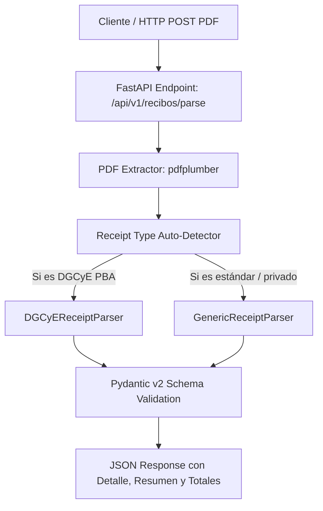

# Plan de Implementación: API FastAPI para Análisis de Recibos de Sueldo en PDF (Adaptado a Recibos DGCyE / PBA y Genéricos)

## Goal Description
Construir una API REST profesional en **FastAPI** con **Pydantic v2** y **pdfplumber** para recibir archivos PDF de recibos de sueldo mediante solicitudes `POST`, extraer y estructurar automáticamente toda la información en un JSON fuertemente tipado.

El plan ha sido actualizado a partir del análisis del archivo de muestra real [36528392-2026-08-13-17_12_03_336.pdf](file:///home/agustin/proyectos_software/datamaq-hub/data/36528392-2026-08-13-17_12_03_336.pdf), el cual corresponde a un recibo docente/estatal multi-cargo de la **DGCyE (Dirección General de Cultura y Educación - PBA)**, con 4 páginas, tabla consolidada de líquidos y múltiples liquidaciones desglosadas por establecimiento y secuencia.



---

## User Review Required
> [!IMPORTANT]
> - **Estructura DGCyE PBA analizada:**
>   - **Cabecera Organismo:** `PROVINCIA DE BUENOS AIRES - DIRECCION GENERAL DE CULTURA Y EDUCACION`, CUIT `30-62739371-3`.
>   - **Datos del Agente:** Nombre (`BUSTOS AGUSTÍN`), DNI (`36528392`), Sexo (`M`), CUIL (`20-36528392-4`), Mes de pago (`07 / 2026`).
>   - **Tabla Resumen de Líquidos:** 14 secuencias/cargos con importes parciales y un `TOTAL LÍQUIDO` de `$ 2.585.423,32`.
>   - **Desglose de Liquidaciones (Multi-establecimiento / Multi-secuencia):**
>     - Establecimientos (ej. `05-TIGRE`, `11-ESCOBAR`, Instituto Superior, Escuela Secundaria, categorías `IS-0199`, `MT-0001`, `MT-0002`, `MT-0003`).
>     - Cargos (Secuencias `016`, `021`, `022`, `018`, `017`, `020`, `019`, revista `SUP.` / `PROV.`, carga horaria, antigüedad, etc.).
>     - Conceptos con códigos (ej. `0220 ANTIGUEDAD`, `0510/0511 BASICO`, `0667 BONIF`, `1060 I.P.S.`, `1280 I.O.M.A`, `1173/1273 RETENCION PAROS`, `1472/1473 SUTEBA`, `2575 FONID/CONECTIVIDAD`).
> - **Arquitectura Extensible:** Además del parser especializado en DGCyE, se incluye un parser genérico y un detector automático para soportar otros formatos de recibos de sueldo argentinos.

---

## Proposed Architecture & Directory Structure

```
datamaq-hub/
├── .gitignore
├── requirements.txt
├── README.md
├── src/
│   ├── __init__.py
│   ├── main.py                          # Aplicación FastAPI, OpenAPI docs, CORS y exception handlers
│   ├── config.py                        # Configuración de entorno con pydantic-settings
│   ├── api/
│   │   ├── __init__.py
│   │   ├── routes.py                    # Endpoints POST /api/v1/recibos/parse y GET /api/v1/health
│   │   └── dependencies.py              # Inyección de dependencias
│   ├── schemas/
│   │   ├── __init__.py
│   │   ├── recibo.py                    # Modelos Pydantic v2 (DGCyE, Genérico, Agente, Totales, Conceptos)
│   │   └── common.py                    # Modelos de respuesta estándar y errores
│   ├── services/
│   │   ├── __init__.py
│   │   ├── pdf_extractor.py             # Extracción de texto y layout en memoria con pdfplumber
│   │   ├── base_parser.py               # Interfaz abstracta BaseReceiptParser
│   │   ├── dgcye_parser.py              # Parser especializado para recibos DGCyE PBA
│   │   ├── generic_parser.py            # Parser estándar para recibos de sueldo tradicionales
│   │   └── parser_factory.py            # Detección y enrutamiento inteligente del parser correspondiente
│   └── utils/
│       ├── __init__.py
│       ├── validators.py                # Validador de CUIT/CUIL (módulo 11) y DNI
│       └── text_helpers.py              # Normalización de importes (decimales, comas) y parsing regex
├── tests/
│   ├── __init__.py
│   ├── conftest.py                      # Fixtures de test y TestClient
│   ├── test_api.py                      # Tests de integración FastAPI
│   ├── test_dgcye_parser.py             # Test específico con data/36528392-2026-08-13-17_12_03_336.pdf
│   ├── test_generic_parser.py           # Tests del parser genérico
│   └── test_validators.py               # Tests unitarios de helpers y CUIT/CUIL
└── data/
    └── 36528392-2026-08-13-17_12_03_336.pdf
```

---

## Proposed Changes

### 1. Dependencias y Configuración

#### [NEW] [requirements.txt](file:///home/agustin/proyectos_software/datamaq-hub/requirements.txt)
```txt
fastapi>=0.115.0
uvicorn[standard]>=0.30.0
python-multipart>=0.0.9
pydantic>=2.7.0
pydantic-settings>=2.2.0
pdfplumber>=0.11.0
pytest>=8.0.0
httpx>=0.27.0
```

#### [NEW] [.gitignore](file:///home/agustin/proyectos_software/datamaq-hub/.gitignore)
Ignorar `venv/`, `.venv/`, `__pycache__/`, `.pytest_cache/`, etc.

---

### 2. Esquemas Pydantic v2

#### [NEW] [src/schemas/recibo.py](file:///home/agustin/proyectos_software/datamaq-hub/src/schemas/recibo.py)
Modelos detallados:
- **`TipoConcepto`**: Enum (`remunerativo`, `no_remunerativo`, `descuento`)
- **`TipoRecibo`**: Enum (`DGCYE_PBA`, `GENERICO`)
- **`AgenteSchema`**:
  - `nombre_completo`: str
  - `tipo_documento`: str (ej. `"DNI"`)
  - `numero_documento`: str (ej. `"36528392"`)
  - `sexo`: Optional[str] (`"M"` / `"F"`)
  - `cuil`: str (ej. `"20-36528392-4"`)
  - `mes_pago`: str (ej. `"07 / 2026"`)
- **`EmpleadorSchema`**:
  - `organismo_o_empresa`: str
  - `dependencia`: Optional[str]
  - `cuit`: Optional[str]
- **`ResumenLiquidoItem`**:
  - `establecimiento_codigo`: str
  - `secuencia`: str
  - `periodo_liquidado`: str
  - `fecha_pago`: str
  - `orden_pago_codigo`: str
  - `orden_pago_descripcion`: str
  - `liquido_pesos`: float
- **`EstablecimientoDetalle`**:
  - `distrito`: Optional[str]
  - `categoria`: Optional[str]
  - `desfavorabilidad`: Optional[int]
  - `secciones`: Optional[int]
  - `es_carcel`: Optional[bool]
  - `doble_escolaridad`: Optional[bool]
  - `turnos`: Optional[int]
  - `nombre`: Optional[str]
- **`CargoDetalle`**:
  - `secuencia`: str
  - `situacion_revista`: Optional[str]
  - `cargo_real`: Optional[str]
  - `carga_horaria`: Optional[float]
  - `antiguedad_anios`: Optional[int]
  - `dias_trabajados`: Optional[float]
  - `inasistencias`: Optional[float]
  - `periodo_liquidado`: Optional[str]
  - `orden_pago`: Optional[str]
- **`ConceptoItem`**:
  - `codigo`: str
  - `descripcion`: str
  - `haberes`: Optional[float]
  - `descuentos`: Optional[float]
  - `tipo`: TipoConcepto
- **`LiquidacionSecuencia`**:
  - `establecimiento`: EstablecimientoDetalle
  - `cargo`: CargoDetalle
  - `conceptos`: List[ConceptoItem]
  - `subtotal_haberes`: float
  - `subtotal_descuentos`: float
  - `liquido_calculado`: float
- **`TotalesConsolidados`**:
  - `total_haberes_remunerativos`: float
  - `total_haberes_no_remunerativos`: float
  - `total_haberes`: float
  - `total_descuentos`: float
  - `total_liquido`: float
- **`ReciboSueldoResponse`**:
  - `tipo_recibo`: TipoRecibo
  - `empleador`: EmpleadorSchema
  - `agente`: AgenteSchema
  - `resumen_liquidos`: List[ResumenLiquidoItem]
  - `liquidaciones`: List[LiquidacionSecuencia]
  - `totales`: TotalesConsolidados
  - `metadata`: Dict[str, Any] (páginas, tiempo de procesamiento, etc.)

---

### 3. Servicios de Extracción y Parsing

#### [NEW] [src/utils/text_helpers.py](file:///home/agustin/proyectos_software/datamaq-hub/src/utils/text_helpers.py)
- Parser de números decimales de alta precisión (`"2.585.423,32"` -> `2585423.32`, `"2585423.32"` -> `2585423.32`).
- Limpieza de caracteres OCR y normalización de textos.

#### [NEW] [src/services/pdf_extractor.py](file:///home/agustin/proyectos_software/datamaq-hub/src/services/pdf_extractor.py)
- Abre el PDF desde bytes o stream en memoria con `pdfplumber`.
- Extrae texto con layout espacial, líneas y tablas.

#### [NEW] [src/services/dgcye_parser.py](file:///home/agustin/proyectos_software/datamaq-hub/src/services/dgcye_parser.py)
- Motor especializado para recibos DGCyE PBA:
  - Extracción de cabecera de agente y empleador.
  - Extracción de la tabla de LÍQUIDOS de la página 1.
  - Agrupación por bloques de secuencias (`CARACTERISTICAS DEL ESTABLECIMIENTO`, `SECUENCIA`, `COD - HABERES - Descuentos`).
  - Detección de conceptos remunerativos vs no remunerativos (código 2575 FONID, etc.) y descuentos (IPS 1060, IOMA 1280, paros 1173/1273, sindicatos 1472/1473).
  - Cálculo de totales consolidados y validación de consistencia numérica.

#### [NEW] [src/services/parser_factory.py](file:///home/agustin/proyectos_software/datamaq-hub/src/services/parser_factory.py)
- Inspecciona el contenido inicial del PDF y selecciona automáticamente `DGCyEReceiptParser` o `GenericReceiptParser`.

---

### 4. API FastAPI

#### [NEW] [src/api/routes.py](file:///home/agustin/proyectos_software/datamaq-hub/src/api/routes.py)
- `POST /api/v1/recibos/parse`:
  - Recibe el archivo PDF mediante `multipart/form-data` (`file: UploadFile`).
  - Valida el mime type `application/pdf`.
  - Procesa el PDF y retorna el schema `ReciboSueldoResponse` con código `200 OK`.
  - Retorna `400 Bad Request` ante archivos no válidos o corruptos.
- `GET /api/v1/health`: Estado del servicio y tiempo de actividad.

#### [NEW] [src/main.py](file:///home/agustin/proyectos_software/datamaq-hub/src/main.py)
- Instancia FastAPI con metadatos de Swagger / OpenAPI.
- CORS habilitado para integración frontend.

---

### 5. Suite de Tests Automatizados

#### [NEW] [tests/test_dgcye_parser.py](file:///home/agustin/proyectos_software/datamaq-hub/tests/test_dgcye_parser.py)
- Test end-to-end con el archivo real `data/36528392-2026-08-13-17_12_03_336.pdf`:
  - Valida que el nombre sea `BUSTOS AGUSTÍN` y DNI `36528392`.
  - Valida que se extraigan las 14 líneas de líquidos.
  - Valida que el total líquido extraído sea exactamente `2585423.32`.
  - Valida las secuencias individuales y conceptos (IPS, IOMA, Básico, etc.).

#### [NEW] [tests/test_api.py](file:///home/agustin/proyectos_software/datamaq-hub/tests/test_api.py)
- Tests de endpoints FastAPI con `TestClient`:
  - `POST /api/v1/recibos/parse` subiendo `data/36528392-2026-08-13-17_12_03_336.pdf`.
  - Verificación de código 200 y validación estricta del JSON devuelto contra el esquema Pydantic.
  - Verificación de error 400 al enviar archivos no-PDF.

---

## Verification Plan

### Automated Tests
1. **Creación del entorno virtual e instalación**:
   ```bash
   python3 -m venv venv
   source venv/bin/activate
   pip install -r requirements.txt
   ```
2. **Ejecución de la suite completa de tests**:
   ```bash
   pytest -v
   ```

### Manual Verification
1. **Iniciar servidor**:
   ```bash
   uvicorn src.main:app --reload --port 8000
   ```
2. **Probar vía cURL o Swagger UI (`http://localhost:8000/docs`)**:
   ```bash
   curl -X POST "http://localhost:8000/api/v1/recibos/parse" \
     -H "accept: application/json" \
     -H "Content-Type: multipart/form-data" \
     -F "file=@data/36528392-2026-08-13-17_12_03_336.pdf"
   ```
3. Verificar que la respuesta contenga el JSON con todos los datos extraídos y validados correctamente.
